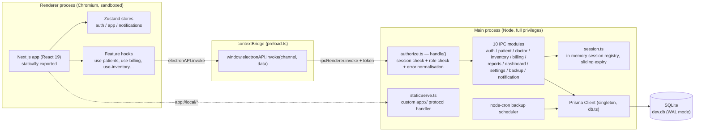
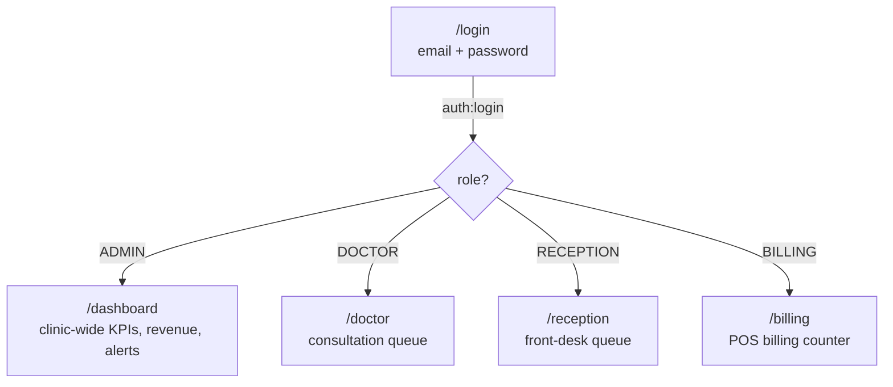
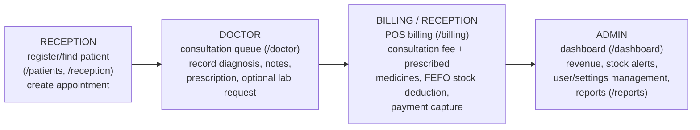
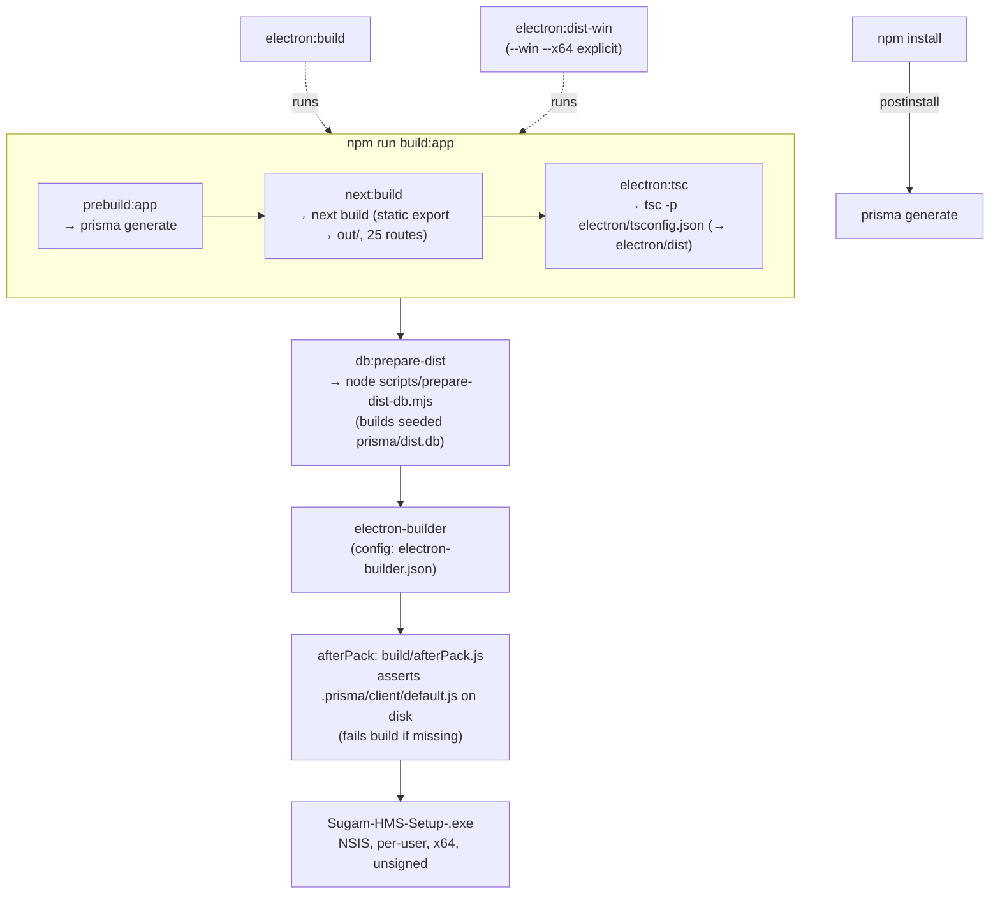

# Sugam HMS — End-to-End Architecture

_Snapshot date: 2026-07-20. Reflects `sugam_software/` as currently on disk._

## 1. What it is
Offline-first, single-tenant desktop Hospital Management System for one hospital/pharmacy site. Packaged as a Windows desktop app (Electron) with an embedded SQLite database — no server, no internet dependency at runtime. Covers patient records, doctor consultations/appointments, pharmacy inventory, POS billing, reporting, and admin settings.

## 2. Tech stack
| Layer | Technology |
|---|---|
| Desktop shell | Electron 33 (Chromium + Node main process) |
| UI framework | Next.js 15 (App Router, React 19), statically exported (`next build` → `out/`) |
| Styling | Tailwind CSS v4, shadcn/ui (Radix primitives), Framer Motion |
| State | Zustand (`auth.store`, `app.store`, notification store) |
| Forms/validation | react-hook-form + zod |
| ORM / DB | Prisma 5 → SQLite (file-based, `dev.db`) |
| Auth | JWT (jsonwebtoken) + bcrypt password hashing, custom in-memory session registry in main process |
| Charts | Recharts (lazy-loaded) |
| Export | xlsx (lazy-loaded), jspdf |
| Scheduling | node-cron (DB backups) |
| Packaging | electron-builder (NSIS installer, Windows x64) |

## 3. Process architecture

Two isolated processes, bridged only through a locked-down IPC surface — the renderer never touches Node, the filesystem, or Prisma directly.



### Why this shape

- **No HTTP server, no network stack.** The renderer loads either `http://localhost:3000` (dev, Next dev server) or a custom `app://` protocol serving the static-exported `out/` directory (prod). `staticServe.ts` resolves extensionless routes to `<path>.html`, then `<path>/index.html`, then falls back to `index.html` for SPA-style client routing — it must never `readFile()` a directory (a past bug: Next emits both `out/billing.html` and `out/billing/` for the same route).
- **contextIsolation: true, nodeIntegration: false.** The renderer can only call `window.electronAPI.invoke(channel, data)`, injected by `preload.ts`. The bridge allowlists channel name prefixes (`auth:`, `patient:`, `billing:`, …) — an arbitrary string can't reach internal Electron/Node channels.
- **Every IPC call is authenticated server-side.** `preload.ts` reads the JWT out of the renderer's own `localStorage['sugam-hms-auth']` and attaches it as a trailing `invoke()` argument. The renderer's own claims about who it is are never trusted for authorization — only the token, verified in the main process.

## 4. Request lifecycle (a single button click, end to end)

1. UI component calls a feature hook (e.g. `use-billing.ts` → `saveInvoice()`).
2. Hook calls `window.electronAPI.invoke('billing:invoice:create', payload)`.
3. `preload.ts` validates the channel prefix, reads the JWT from `localStorage`, calls `ipcRenderer.invoke(channel, payload, token)`.
4. In the main process, every channel is registered via `authorize.ts`'s `handle()` wrapper (not raw `ipcMain.handle`):
   - Public channels (`auth:login`, `auth:verify`, `auth:logout`) skip session checks.
   - All others: `getSession(token)` — checks JWT signature/expiry, sliding idle timeout (12h), absolute cap (30d). No session → `{ success:false, code:'SESSION_EXPIRED' }`.
   - Per-channel role check against a static `CHANNEL_ROLES` map (mirrors client-side RBAC — an unmapped channel fails closed).
   - Only then does the real handler in `electron/ipc/billing.ipc.ts` run, inside the actual `session` (never renderer-supplied identity).
5. Handler does business logic against the Prisma singleton (`electron/db.ts`), typically inside a `$transaction` (e.g. invoice creation: stock validation → FEFO batch deduction → invoice row → `AuditLog` write, all-or-nothing).
6. Result returns as `{ success, data }` or `{ success:false, error }` — a thrown exception is caught and normalised by `authorize.ts` so it can never crash the renderer's `await`.
7. If the response carries `code:'SESSION_EXPIRED'`, `preload.ts` clears the stored token and redirects to `/login`.

## 5. User flow (by role)

Login is the single entry point. `auth:login` returns a role; `use-auth.ts` redirects straight to a role-specific landing page — there is no shared home screen. The sidebar (`components/layout/sidebar.tsx`) then filters nav items to that role, so a role never sees a link to a page it can't act on (backed server-side by the same role map in `authorize.ts`, §8).



### Nav visibility per role (sidebar filter)

| Page | ADMIN | DOCTOR | BILLING | RECEPTION |
|---|:---:|:---:|:---:|:---:|
| Dashboard | ✅ | | | |
| Reception Desk | ✅ | ✅ | | ✅ |
| Doctor Panel | ✅ | ✅ | | |
| Patients | ✅ | ✅ | ✅ | ✅ |
| Doctors | ✅ | ✅ | | ✅ |
| Hospital Billing | ✅ | | ✅ | ✅ |
| Direct Billing | ✅ | | ✅ | |
| Medicine Stock | ✅ | ✅ | ✅ | |
| Reports | ✅ | | ✅ | |
| Settings | ✅ | | | |

### Core cross-role journey: a patient visit

The four roles chain together around one patient record and one invoice — this is the flow the whole system is built to support:



- Reception can also bill directly (`billing:invoice:create` is open to RECEPTION), so the Billing step doesn't strictly require a BILLING-role user on a small shift.
- `Direct Billing` (/direct-billing, ADMIN/BILLING only) skips the patient/doctor steps entirely — for walk-in pharmacy-only sales with no consultation.
- Every write in this chain (`patient:create`, `doctor:consultation:create`, `billing:invoice:create`, …) is independently role-checked server-side (§8) — the UI hiding a link is a convenience, not the actual boundary.

## 6. Directory map

```
sugam_software/
├── electron/                  # Main process (Node) — compiled by electron:tsc → electron/dist
│   ├── main.ts                 entrypoint: single-instance lock, migration gate, window creation
│   ├── preload.ts               contextBridge surface (allowlist + token attach + session-expiry handling)
│   ├── db.ts                    Prisma client singleton + initDatabasePragmas (WAL, busy_timeout, FKs)
│   ├── migrate.ts                applies pending Prisma migrations against the userData DB at startup
│   ├── session.ts                in-memory session registry (createSession/getSession/destroySession)
│   ├── audit.ts                  writeAudit() — attributes every mutation to the real session user
│   ├── age.ts                    calculateAge() — Patient.age computed on read, not stored authoritative
│   ├── auth-secret.ts             per-install random JWT secret persisted in userData
│   ├── env.ts                     provisions DATABASE_URL / query engine path before any Prisma import
│   ├── staticServe.ts             custom app:// protocol + static file resolution
│   ├── protocol.ts                deep-link (sugamhms://) URL protocol registration
│   ├── tray.ts                    system tray icon/menu
│   ├── updater.ts                 electron-updater wiring (no-ops offline/dev)
│   ├── cron.ts                    node-cron scheduled DB backups
│   ├── backup-util.ts             backup create/restore/verify (WAL checkpoint + integrity_check)
│   ├── logger.ts                  dependency-free rotating file logger (userData/logs/main.log)
│   └── ipc/
│       ├── authorize.ts           handle() — session + role-gate + error-normalise wrapper for ALL channels
│       ├── auth.ipc.ts            login / verify / logout / change-password
│       ├── patient.ipc.ts         patient CRUD, documents, Excel import/export
│       ├── doctor.ipc.ts          doctor list/queue/history, consultations, walk-in appointments
│       ├── inventory.ipc.ts       categories, suppliers, medicines, batches, purchases
│       ├── billing.ipc.ts         POS invoice create/return, FEFO stock deduction, invoice list/export
│       ├── reports.ipc.ts         revenue / patients / inventory / doctor reports
│       ├── dashboard.ipc.ts       admin dashboard stats/widgets
│       ├── settings.ipc.ts        app settings, user management (create/deactivate)
│       ├── backup.ipc.ts          manual backup/restore, schedule reconfig
│       ├── notification.ipc.ts    in-app notification tray CRUD
│       └── schemas/               zod request schemas (patient.ts, inventory.ts) — partial IPC-boundary validation
│
├── prisma/
│   ├── schema.prisma            SQLite datasource + full data model (see §7)
│   ├── migrations/                versioned SQL migrations, applied at runtime by migrate.ts
│   └── seed.js / seed.ts          seeds demo hospital data + 4 role logins
│
├── src/                        # Renderer (Next.js App Router, statically exported)
│   ├── app/
│   │   ├── (auth)/login/          login screen
│   │   └── (dashboard)/            authenticated shell: dashboard, patients, doctors, inventory,
│   │                                billing, direct-billing, reception, reports, settings, notifications
│   ├── components/
│   │   ├── layout/                 dashboard-shell.tsx (gates render on auth:verify), sidebar, topbar
│   │   ├── common/                  data-table, page-header, metric/stat cards, export-button, etc.
│   │   └── ui/                      shadcn/ui primitives (button, dialog, select, tabs, …)
│   ├── features/                  domain modules, each with hooks/ + types/ (+ schemas/ where validated)
│   │   ├── auth/ patients/ doctors/ inventory/ billing/ reports/ settings/ dashboard/
│   ├── store/                     auth.store.ts (JWT + user, persisted to localStorage),
│   │                                app.store.ts, use-notification.ts
│   ├── hooks/                     use-ipc.ts (invoke wrapper), use-pagination, use-debounce, use-local-storage
│   └── lib/                       constants.ts, utils.ts, excel.ts, pdf.ts (jspdf, currently unused), crypto.ts
│
├── electron-builder.json        canonical packaging config (see §9) — package.json's own `build` block was
│                                  a duplicate that electron-builder silently ignored; removed
├── build/afterPack.js            packaging backstop: asserts .prisma/client/default.js landed on disk
└── scripts/prepare-dist-db.mjs   builds prisma/dist.db shipped as the fresh-install seed database
```

## 7. Data model (SQLite via Prisma)

Single database, ~20 models grouped by domain:

- **Identity/RBAC:** `User` (role: ADMIN/DOCTOR/BILLING/RECEPTION, soft-deleted via `isActive`), `Doctor` (1:1 with User), `AuditLog` (every mutation, attributed to real `session.userId`).
- **Patients:** `Patient` (soft-delete via `isDeleted`), `PatientVisit`, `PatientDocument`, `Appointment`, `Consultation`, `Prescription`, `LabRequest`.
- **Inventory:** `MedicineCategory`, `Supplier`, `Medicine` (with `unitsPerPack` for strip↔tablet loose-unit billing), `MedicineBatch` (FEFO stock by `expiryDate`), `PurchaseOrder`.
- **Billing:** `Invoice` (patient or walk-in), `Payment`, `InvoiceReturn`.
- **Ops:** `AppSetting` (key/value app config), `Notification`, `DailySummary`, `Backup`.

Notable design points:
- Money-critical quantities (batch stock, billing qty) are always base units (tablets); `mrp`/`sellingPrice` stay per-pack, per-unit rate derived at compute time (`sellingPrice / unitsPerPack`) — server-recomputed at invoice time, never trusts a client-supplied price.
- Hot paths (FK columns, `expiryDate`, `date`, `isActive`, etc.) have explicit `@@index` — 24 added in a dedicated performance migration.
- WAL mode + `busy_timeout` + `foreign_keys=ON` pragma set on every startup (`db.ts` `initDatabasePragmas()`), since SQLite is single-writer and the app is single-process but must tolerate concurrent internal connections (cron backup vs. live IPC).

## 8. Auth & authorization model

- **Login:** `auth:login` verifies bcrypt hash, issues a JWT (per-install random secret, `electron/auth-secret.ts`), creates a server-side session entry in `electron/session.ts`.
- **Session semantics (sliding window):** JWT absolute expiry 30 days; server-tracked `lastActivity` expires the session after 12h idle regardless of JWT validity. Every authorized call slides `lastActivity` forward — an active POS shift is never force-logged-out mid-transaction; an unattended terminal times out.
- **Renderer persistence:** token + user kept in Zustand `auth.store`, persisted to `localStorage['sugam-hms-auth']`. `DashboardShell` re-verifies via `auth:verify` on mount so a restarted app re-establishes (or rejects) the session against the live DB `isActive` flag.
- **Authorization enforcement:** 100% server-side as of the July 2026 hardening pass — every one of the ~65 IPC channels is routed through `authorize.ts`'s `handle()`, which hard-fails closed on any channel missing from `CHANNEL_ROLES`. (Earlier state, now superseded: RBAC used to be client-side only, driven by `ROLE_PERMISSIONS` in `auth.types.ts` / sidebar visibility — that map is now mirrored server-side as the actual gate.)
- **Audit trail:** mutating handlers call `writeAudit(session, action, entity, entityId, metadata)` — attributed to the real authenticated actor, not inferred.

## 9. Build & packaging pipeline



Key packaging facts:
- Single canonical config: `electron-builder.json` (a duplicate `build` block once lived in `package.json`; electron-builder ignores that when the standalone file exists, so it was deleted to avoid silent drift).
- Prisma's generated `.prisma/client` output must be captured via an explicit `{ from, to }` file-set mapping, not a glob — electron-builder's default walker skips dot-prefixed directories and a glob still gets pruned by the prod-dependency walker; only an explicit mapping lands it inside the asar header index (required for `require()` to resolve it from inside `app.asar`).
- `asarUnpack` covers native binaries (`*.node`, the ~19 MB Prisma query engine DLL) since asar can't execute native code from inside the archive.
- `build/afterPack.js` hard-asserts the Prisma client landed on disk post-pack — fails the build loudly instead of shipping a broken installer.
- Fresh installs get `prisma/dist.db` (seeded) copied to userData as `dev.db`; in-place upgrades instead run `migrate.ts`'s pending-migration runner against the existing userData DB at every startup, before the window loads.
- Unsigned installer → Windows SmartScreen warning is expected/unavoidable without a purchased code-signing certificate.

## 10. Cross-cutting concerns

- **Logging:** `electron/logger.ts` — dependency-free rotating file log at `%APPDATA%/sugam-hms/logs/main.log`; renderer `console.*` (including uncaught JS errors) is mirrored into the same file via `webContents.on('console-message')`, so client-side failures are visible in the one file support asks users for.
- **Crash handling:** `main.ts` traps `uncaughtException`/`unhandledRejection` at the process level (dialog + log, no silent death); `ErrorBoundary` wraps the renderer root.
- **Backups:** `node-cron` scheduled + manual, WAL-checkpointed before copy, `PRAGMA integrity_check` run on both create and restore; restore snapshots the current DB first and signals `restartRequired`.
- **Performance:** heavy client libs (`xlsx`, `recharts`) are lazy-loaded via `next/dynamic` to keep first-load JS down; list views use paginated `DataTable` rather than virtualization (judged sufficient at single-clinic scale).
- **Validation:** zod schemas exist at the IPC boundary for `patient` and `inventory` writes (`electron/ipc/schemas/`); other channels still trust `data: any` from the renderer — a known partial gap, not yet extended to billing/doctor/settings payloads.

## 11. Known architectural gaps (as of this snapshot)

- zod validation at the IPC boundary is not yet universal (billing, doctor, settings payloads still untyped `any` server-side).
- Backup verification (`backup:verify` → `integrity_check`) has a recurring, still-uninvestigated failure mode (`Error code 14: unable to open the database file`) that silently discards some scheduled backups.
- `InvoiceReturn.invoiceId` is `@unique`, so a partial return blocks any further partial return against the same invoice.
- `src/lib/jwt.ts` and `src/lib/pdf.ts` appear dead (unused elsewhere in the renderer) — candidates for removal.
- No automated test suite; verification to date has been manual/scripted CDP smoke tests against packaged builds (see `SMOKE_TEST.md`).

## 12. Environments & entry points

| Mode | Command | Renders from |
|---|---|---|
| Dev (hot reload) | `npm run electron:dev` | Next dev server at `localhost:3000` |
| Dev, static (low-memory machines) | `HMS_SERVE_STATIC=1 electron .` | prebuilt `out/` via `app://` |
| Packaged | installed `.exe` | `out/` bundled in `app.asar`, via `app://` |

Both dev paths require `DATABASE_URL` set explicitly (electron's main process has no dotenv loader — only Next.js auto-loads `.env`) and `ELECTRON_RUN_AS_NODE` unset (some shells, including VSCode's integrated terminal, set it to `1`, which breaks `require('electron').app`).
